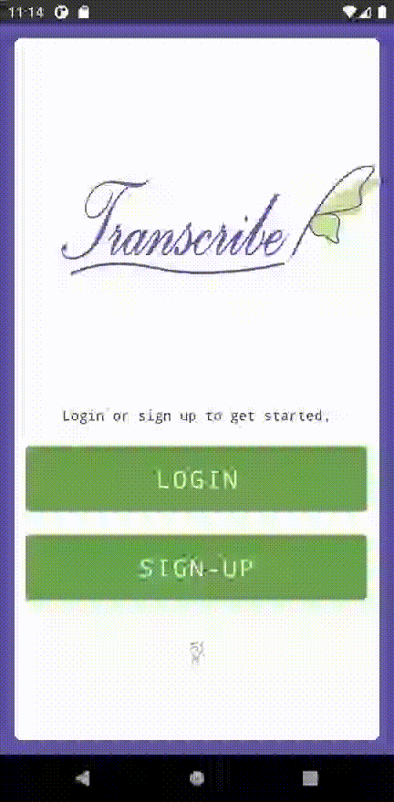

# Transcribe
## Final Project  
This is the final version of an Android app built for CS 402 at Boise State University.    
[Link to video presentation](https://drive.google.com/file/d/1_gFsn7BV8SeYTk9jrU_eBczIX9YM0bg4/view?usp=sharing)

### App Store Description:
**A health app built with you in mind.** 
Navigating your health, safety, and well-being can be difficult when you exist outside the realm of socially expected gender, with medical environments becoming stressful and alienating if you don't fit into your assigned-at-birth box. **Transcribe** aims to fit your expectations and needs, instead of the other way around, helping you to track and monitor important mental and physical health information, while also fostering community knowledge to help you feel more prepared and less alone.  

## Start Activity
The start activity of Transcribe allows users to create a new account or login using existing credentials. Currently, user account data is only being saved locally using [ObjectBox](https://objectbox.io/) (a NoSQL database). As user information is not secure, the app is not currently appropriate for real-life use. 

When a new account is created, the provided email is validated using the [mailboxlayer API](https://mailboxlayer.com/). It provides a "validity score" based on an SMTP check and MX-Records. Emails with a low score will not be accepted for account creation. 

## Profile
Currently, the only feature available on the user profile is adding/editing/deleting medications/supplements. A user can do this by selecting the "add pill bottle" icon, which will take them to a separate activity to add a new item. After an item is added, the user can edit it by selecting the round edit button on the right-hand side of the item's entry under "Medications & Supplements"
This process utilizes the publisher/subscriber pattern using the [EventBus](https://greenrobot.org/eventbus/) library. 
Items are also saved to an ObjectBox database and are persistent across log-ins - that is, a user can exit and return, and there medications will be saved under their account. 

GIF HERE

The default profile picture (light purple smiley face) can also be replaced by a user-chosen photo, either through taking a new picture or choosing from the gallery. New photos taken will be saved to the device, and the chosen picture's path will be saved and appear the next time a user logs in.

GIF HERE

## Community
Here, I have implemented a RecyclerView to later display the available topics in the Community section. Right now, they are just being labelled as per the example dummy repository. However, tapping the plus button on each topic will open up a (right now, filler) data graph. This graph is generated using [AAChartCore](https://github.com/AAChartModel/AAChartCore), a pretty powerful yet simple library that takes away a lot of the pain that other graph libraries I was trying to use caused. 

There is a display issue that causes the graph to not always load or load after you've scrolled away. I think this is caused how the RecyclerView decides to load or not load elements.  

## Contribute
By tapping on the "Contribute" button on each Community item, you are taken to a survey that is implemented using [SurveyKit](https://github.com/quickbirdstudios/SurveyKit). Once the survey is complete, the survey data collected is currently stored in the local database. A relation exists between this data and the user who contributed it, which will later be used to show the user what they have contributed to and to prevent duplicate entries.   
Later, this data will be what is used to create the graphs under each topic. 

## Other Info

Video demo can be viewed [here.](https://drive.google.com/file/d/1n6UoygpFSYBAmYKhXFWuMNAWRxUAU_tJ/view?usp=sharing)
A **signed app bundle** is available in the `export` folder..   
The **Play Store Icon** is available in the ``marketing` folder as `ic_launcher-playstore.png`. 

I got blindsided by a bunch of responsibilities these past weeks, so this submission is a little more lackluster than I wanted it to be, but c'est la vie!