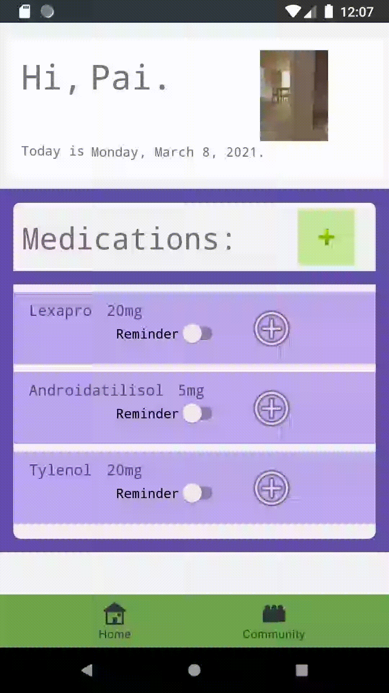

# Project 1 - Davis-2021-Sprint-CS402

## App Summary:

Transcribe is a medical tracking app geared towards transgender and non-binary people. In addition to the usual medical/mood/day tracking functionality such asmedication/supplement reminders and symptom/side effect tracking, Transcribe also features a "Community" aspect. 
Since information about HRT and other medical transitioning aspects is usually anecdotal in nature, Transcribe is meant to build off of this existing tradition, while also making this information more organized and accessible.

Project 1 Demo: https://youtu.be/CzH6loHmu5Y

The app is currently a WIP, but below is a description of some of its planned functionality. 

_Note: It looks much less put together than my first version, but it *works* better. By that, I mean the implementation is much cleaner/smarter, and more modular, which will mean expanding on functionality in the future will be much quicker and easier._

### User Login and Registration

Currently, the login button takes you directly to the profile screen.
The sign-up button takes you to a registration form, which uses the [mailboxlayer API](https://mailboxlayer.com/) to validate the inputted email, and will eventually create a user account to be saved in an external database. 

(Sorry the gifs are huge, my attempt at resizing them didn't work too well.)

### Profile

The profile screen is pretty basic at the moment. The medication tabs are implemented as fragments, which can are being created programatically from user input by pressing the + button to the right of "Medications."

  
  
  
The profile image in the upper-right can also be changed by touching and holding the current image.   
  

### Community

The task bar at the bottom takes you to the community page. Here, community data will be shown, hopefully with the help of [MPAndroidChart](https://github.com/PhilJay/MPAndroidChart), which is only partially implemented at the moment under the placeholder topic. 
  

